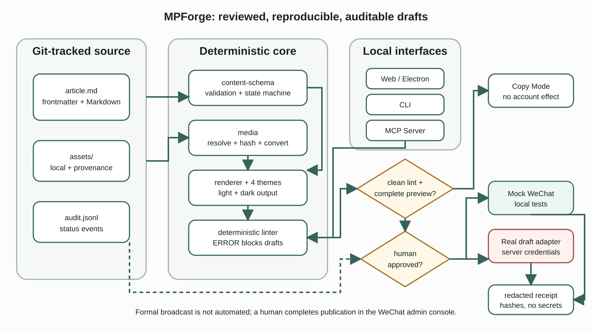

# MPForge architecture

MPForge turns Markdown into a reviewed, reproducible, and auditable WeChat draft. Its core invariant is that the web interface, CLI, MCP server, and CI should not implement separate publishing rules.



The editable Mermaid source is [`docs/architecture/mpforge-architecture.mmd`](docs/architecture/mpforge-architecture.mmd). The SVG is an original, hand-authored vector artifact with no external images or fonts.

## Data flow

1. `content/<slug>/article.md` and `assets/` are the source of truth.
2. `@mpforge/content-schema` validates and migrates Frontmatter and governs status transitions. Every transition appends an exact event to `history/state-events.jsonl`.
3. `@mpforge/content-store` provides the Node filesystem implementation for article creation, conflict-safe atomic save, backup/recovery, state transition, project trash/restore, listing, and watching. Browser and Electron storage ports reuse the same schema and transition rules.
4. `@mpforge/media` resolves only authorized article assets, tracks provenance, hashes content, and provides conversion/upload abstractions.
5. `@mpforge/renderer` converts Markdown through AST normalization, safe HTML generation, inline original-theme styling, sanitization, canonical output, and SHA-256 evidence. Repeated renders provide determinism evidence.
6. `@mpforge/linter` checks source, assets, rendered HTML/CSS, and repeated-render hashes. Any ERROR blocks draft creation.
7. `@mpforge/preview` renders source/safe/WeChat simulation stages in network-blocked local Chromium at 375/402 px, safely inlines bounded local assets, captures screenshots, and records layout/contrast/browser errors.
8. `@mpforge/review-gate` requires current source, render, WeChat, lint, manifest, theme, version, settings, preview, and commit evidence plus an explicit human checklist. Approval and invalidation JSONL records are hash chained.
9. `@mpforge/draft-operations` freezes validated release evidence into `operations/<id>/snapshot`, binds a plan, and owns the idempotency ledger, status/events, upload map, reconciliation, and receipt integrity.
10. `@mpforge/wechat-adapter` exposes only draft-box capabilities. Mock connects only to the loopback service; Real uses server-side credentials and the verified official draft/material contract.
11. `@mpforge/side-effect-gate` allows automated Mock execution but requires a verified human surface and a one-time operation/account/plan-bound challenge for Real execution.
12. Web, CLI, and MCP call the same headless packages. MCP may prepare a Real plan and request human handoff, but it has no Real execute capability.

## Trust boundaries

```text
untrusted Markdown and assets
           │ schema + path checks
           ▼
deterministic local build ──────── no account side effect
           │ lint ERROR gate
           ▼
human content approval record
           │ freeze + plan; no account side effect
           ▼
immutable operation snapshot
           │ Mock: automation allowed
           │ Real: separate human side-effect approval
           ▼
draft-only provider boundary ───── credentials remain server-side
```

The browser never receives AppSecret or access tokens. Round 3 implements a Real draft adapter contract but does not call it during verification. Only an interactive human session may cross the Real side-effect gate. The project contains no formal delivery or follower-distribution provider surface.

## Inherited boundary

The React/Vite editor, Electron shell, Markdown parser, copy flow, browser-local storage, and parts of the theme/dark-mode implementation originate in WeMD. MPForge adds headless packages beside them and connects them incrementally. See [UPSTREAM.md](UPSTREAM.md) for the exact pinned source and [THIRD_PARTY_NOTICES.md](THIRD_PARTY_NOTICES.md) for license details.

## Reproducibility boundary

A build is identified by the article source hash, Git commit, renderer/theme version, rendered HTML hash, local asset hashes, and lint report hash. Screenshots and receipts are derived evidence; they must never be treated as source or silently edited.
