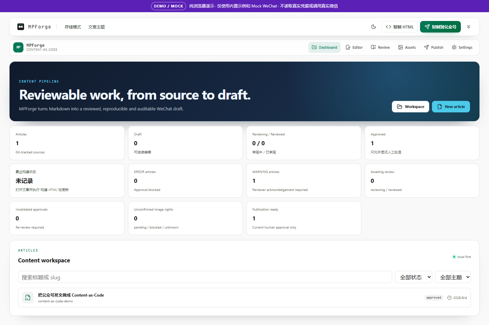
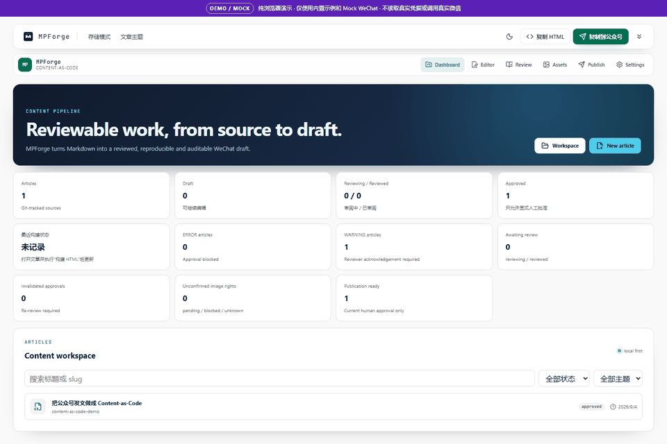

# MPForge

**A Git-driven, agent-friendly Content-as-Code workbench for WeChat Official Account drafts.**

`Markdown → lint → media checks → WeChat preview → human approval → Mock or Official Account draft box`

[简体中文](README.md) · [Security](SECURITY.md) · [Upstream](UPSTREAM.md) · [Provenance](docs/PROVENANCE.md)

> Based on WeMD by the WeMD Team, pinned at commit `964525d80ef63477c3a4b0327fe2a43415ee2bad`. MPForge preserves the upstream MIT notice and is not affiliated with Tencent or WeChat. v0.1.0 does not automate formal publishing or mass sending. Real draft creation requires the user's own lawful account configuration and has not been live-account verified. Demo mode is Mock-only.

MPForge treats an article as a versionable project rather than a single editor document. Markdown, asset provenance, deterministic lint/build evidence, human approval, operation plans and redacted receipts can be reviewed together.





[Online Mock Demo](https://me-fake-you.github.io/mpforge/) · [Release status](https://github.com/me-fake-you/mpforge/releases)

Windows installer and portable candidates pass local startup checks but are not publicly released. Electron includes an LGPL-2.1-or-later FFmpeg shared library. Authorization and delivery of its corresponding-source compliance attachments are still pending, so the v0.1.0 Release remains blocked. Source and browser-only Demo do not distribute that DLL.

## Try it in 30 seconds

Requirements: Node.js 22.12+ and pnpm 9. All dependencies and caches created by the project-local setup stay under the checkout.

```bash
pnpm install --frozen-lockfile
pnpm demo
```

Demo mode seeds an original example into browser storage, displays a permanent `DEMO / MOCK` banner, and offers a browser-memory Mock WeChat flow. It does not read real account environment variables or expose the Real Draft action.

The online Demo is browser-only and Mock-only. Windows candidates are unsigned, so Windows may show a security warning. When downloads become available, the [Release page](https://github.com/me-fake-you/mpforge/releases) will include `SHA256SUMS`, SBOMs and third-party license materials. A successful local build is not evidence of a published Release.

## What v0.1.0 includes

- Markdown editor and light/dark mobile-style preview inherited from WeMD.
- Four MPForge themes: `minimal`, `academic-blue`, `warm-editorial`, and `tech-dark-accent`.
- Deterministic Content-as-Code schema, linter, renderer and asset manifest.
- Asset source, hash, optimization and rights-status checks.
- Human-only approval gate; agents and AI cannot approve.
- Immutable Mock/Real operation plans, idempotency, redacted receipts, uncertain-state reconciliation and side-effect gates.
- Local Mock WeChat server, project-local CLI, stdio MCP server and project skills.
- Electron desktop build and a pure browser Demo mode.

The inherited license-ambiguous `apps/server` is deliberately absent from the public source, workspace, lockfile, Docker build, artifacts and clean public history. External upload endpoints are optional, explicitly configured and fail closed when absent.

## Content-as-Code

```text
content/<slug>/
├── article.md
├── assets/manifest.json
├── build/
├── history/
└── receipts/
```

The normal state path is `idea → draft → reviewing → reviewed → approved → sent_to_draft`. Only an explicit human action can produce approval. Mock execution can demonstrate successful upload/draft creation, `UNKNOWN_REMOTE_STATE`, read-only reconciliation and duplicate prevention without contacting WeChat.

## Development, Doctor, CLI and MCP

```bash
pnpm install --frozen-lockfile
pnpm build
pnpm mpforge doctor
pnpm dev
```

The Doctor reports Node, pnpm, project/write access, optional browser capability, Mock availability, configuration presence, safe environment state and whether real WeChat is disabled. It never prints credential values.

Project-local CLI examples:

```bash
pnpm mpforge init
pnpm mpforge new my-article
pnpm mpforge lint my-article
pnpm mpforge render my-article
pnpm mpforge preview my-article
pnpm mpforge draft prepare my-article --mock
```

Build and start the local stdio MCP server:

```bash
pnpm --filter @mpforge/mcp build
node apps/mcp/dist/index.js
```

MCP intentionally has no tool that grants human approval or directly executes a real-account draft. Use [the draft adapter documentation](docs/WECHAT_DRAFT_ADAPTER.md) and never place secrets in source, prompts, logs or issues.

## Safety and verification

CI and Demo use:

```text
MPFORGE_NETWORK_MODE=mock-only
MPFORGE_REAL_WECHAT_DISABLED=true
MPFORGE_DEMO_MODE=true
```

Run the local gates with:

```bash
pnpm test
pnpm typecheck
pnpm qa
pnpm build
pnpm test:e2e
node scripts/audit-public-boundary.mjs
```

The presence of a workflow is not evidence that a remote run passed. Release claims are made only from recorded outputs. Unsigned Windows builds may trigger a system warning; MPForge never claims a signature it does not have.

## Skills, architecture and provenance

Project-local skills under `.agents/skills/` help agents operate the authoring, lint, media, review and draft workflows without bypassing human gates. Architecture and trust boundaries are documented in [ARCHITECTURE.md](ARCHITECTURE.md), [SECURITY.md](SECURITY.md), and [docs/PUBLIC_RELEASE_BOUNDARY.md](docs/PUBLIC_RELEASE_BOUNDARY.md).

The authoritative fork record is [UPSTREAM.md](UPSTREAM.md). See [NOTICE.md](NOTICE.md), [THIRD_PARTY_NOTICES.md](THIRD_PARTY_NOTICES.md), [LICENSE_POLICY.md](LICENSE_POLICY.md), and [third_party/SOURCE_REGISTRY.md](third_party/SOURCE_REGISTRY.md) for attribution and distribution decisions.

## Roadmap and contribution

The next priority after v0.1.0 is an agent-native content pipeline, topic library, content calendar and multi-account workspace, exercised using public MPForge content.

Contributions are welcome after reading [CONTRIBUTING.md](CONTRIBUTING.md), [SECURITY.md](SECURITY.md), and [CODE_OF_CONDUCT.md](CODE_OF_CONDUCT.md). Do not submit private articles, credentials, cookies, real receipts or assets without publication rights.

## License

The repository uses the MIT License and retains WeMD's copyright notice. Third-party components keep their own licenses and notices. Product and trademark names are used only to describe interoperability.
