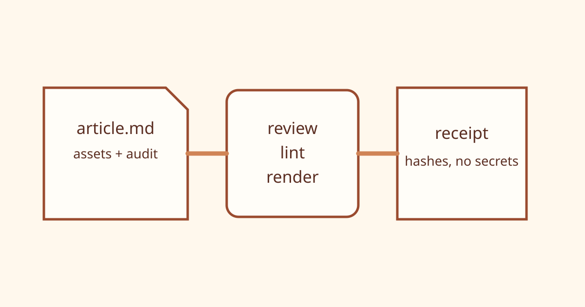

# 一篇文章如何成为可审计的构建单元

普通 Markdown 文件记录正文；Content-as-Code 目录还记录素材、质量检查、预览、状态变更和草稿回执。



## 目录先于工具

一个最小文章单元可以写成：

```text
content/example/
  article.md
  audit.jsonl
  assets/
  build/
  receipts/
```

目录约定让 Web、CLI 和 Agent 使用相同输入，不需要为每个入口重新解释文件在哪里。

## 各阶段留下什么

| 阶段 | 输入                    | 可检查输出      |
| ---- | ----------------------- | --------------- |
| 编写 | Markdown 与 Frontmatter | Git 差异        |
| 审校 | 正文与来源说明          | Linter 报告     |
| 渲染 | 主题与本地素材          | HTML 与预览哈希 |
| 草稿 | 人工批准与账号别名      | 脱敏回执        |

## 闸门应当可以失败

```ts
if (article.status !== "approved" || lint.summary.errors > 0) {
  throw new Error("DRAFT_BLOCKED");
}
```

这段条件的价值不在于代码复杂，而在于所有入口都必须遵守它。

> 可审计不是收集更多日志，而是让关键决定能对应到明确的输入、操作者和结果。

## 回执不等于正式发布

草稿回执记录源提交、HTML 哈希、素材哈希和结果，但不记录密钥、Token、Cookie 或完整账号凭据。即使草稿创建成功，正式群发仍由人类在公众号后台完成。
