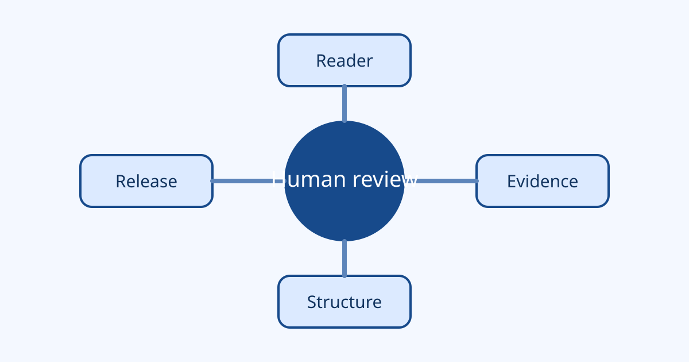

# 把审校拆成四次可回答的问题

“再检查一遍”很难执行，因为它没有说明检查什么。更有效的方法是把审校拆成四个边界清楚的问题。

## 第一问：读者能得到什么

先用一句话写出目标读者和读完后的变化。如果答案含糊，继续增加段落通常不会让文章更清楚。

## 第二问：哪些是事实

把可验证事实与作者观点分开。事实需要来源和时间范围，观点需要说明推理依据。

## 第三问：结构是否支持结论

检查每个小标题是否承担一个独立任务，并确认论据出现在结论之前。

## 第四问：发布条件是否满足

发布前检查本地图片、敏感信息、手机宽度和深色模式。最后的批准必须由人完成并留下审计记录。

> 好的审校不是把文章变得更像某个人，而是让读者更容易验证作者真正想表达的内容。

四次检查都留下结果，下一轮修改才有可比较的起点。
