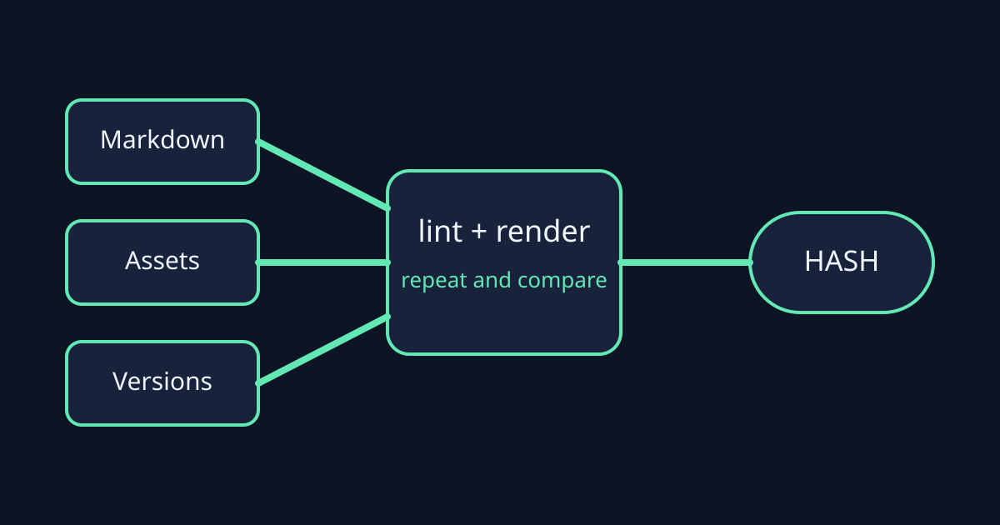

# 确定性构建：让同一篇文章得到同一个结果

内容流水线是否可靠，不只取决于页面看起来是否正确，还取决于相同输入能否稳定产生相同输出。



## 三类需要固定的输入

1. 原稿与本地素材；
2. 渲染器和主题版本；
3. 明确的构建参数，例如浅色或深色模式。

## 用哈希比较两次结果

```ts
const first = renderArticle(request);
const second = renderArticle(request);
const reproducible = first.hashes.html === second.hashes.html;
```

如果两次 HTML 哈希不同，Linter 应阻断草稿创建，并要求先定位时间戳、随机 ID 或不稳定排序等来源。

## 结论

确定性不是一句承诺，而是可以重复执行、比较并保存的证据。
