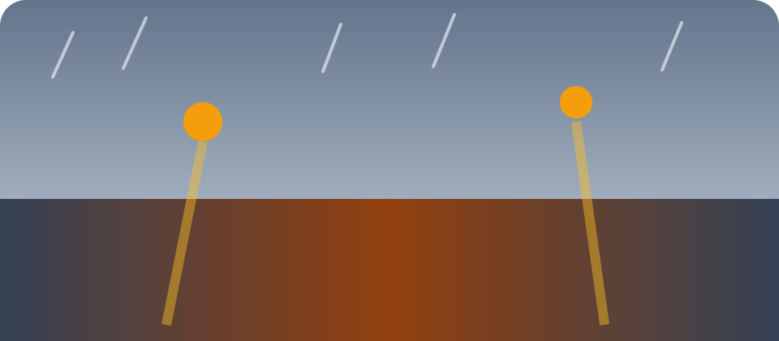

# 雨后散步：在城市边缘重新观察光线

雨停后的半小时，街道像刚被重新冲洗过的底片。路灯还没有完全亮起，湿润的地面却提前把橙色的光接住；行人走过水洼时，影子先被拉长，再被鞋底轻轻打碎。我没有急着举起相机，而是沿着旧围墙慢慢走，等眼睛适应这种介于白昼和夜晚之间的灰蓝。

## 慢一点，画面才会出现

摄影最容易让人误以为“看见”就是按下快门。事实上，真正值得留下的关系往往需要多等一会儿：

- 等公交车驶离，露出被遮住的店门；
- 等一阵风停下，让水面的倒影重新连在一起；
- 等路人走到光线与阴影交界的位置。

> 好照片不一定来自更远的地方，也可能来自对熟悉街道多停留的三分钟。

回程时，云层终于裂开一条窄缝。那束光没有照亮整条街，只落在一扇旧窗和窗前的植物上。我拍下最后一张照片，然后把相机收回包里。观察的练习并不在快门声中结束，它会继续改变我们走路的速度。
