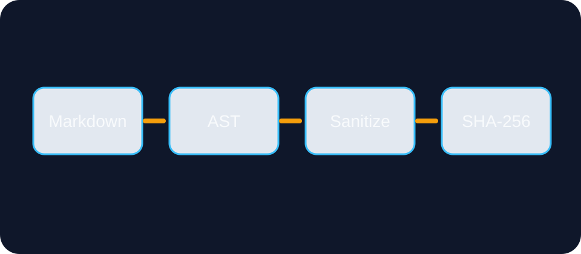
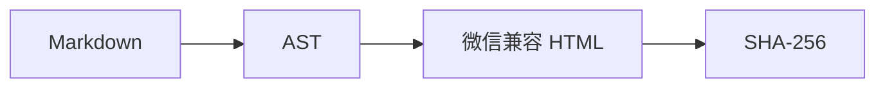

# 确定性渲染：把文章构建变成可验证过程

一条可靠的内容流水线，不只要“看起来正确”，还要能证明相同输入会产生相同输出。



## 流程概览

> 构建时间可以进入元数据，但不应进入正式 HTML。

1. 解析 Markdown 与 Frontmatter；
2. 规范化 AST；
3. 应用版本化主题；
4. 清理危险标签；
5. 对正式 HTML 计算 SHA-256。

```ts
const first = renderArticle(input);
const second = renderArticle(input);
assert.equal(first.hash, second.hash);
```

### 验证表

| 检查项   | 预期         |
| -------- | ------------ |
| 相同输入 | 相同 HTML    |
| 脚本标签 | 被删除       |
| 本地图片 | 保留相对路径 |


